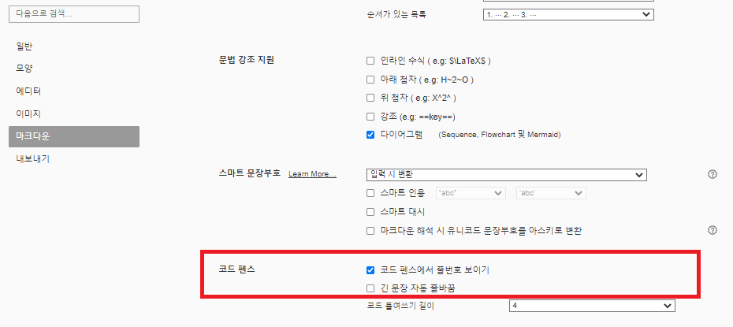
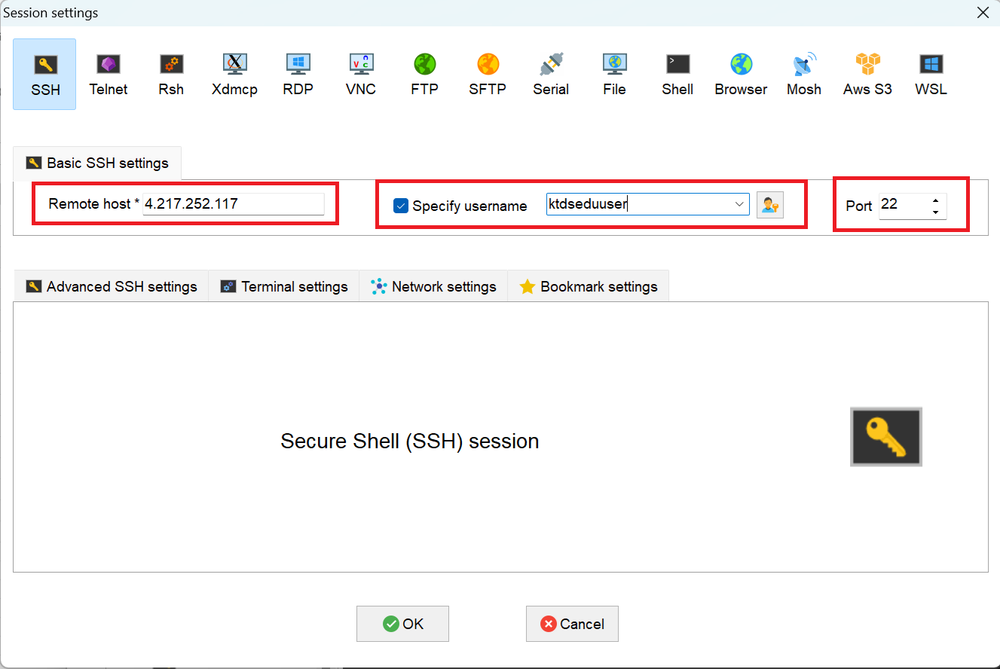

# < 시작전에 >


# 1. 실습 환경 준비(개인PC)


## 1) mobaXterm 설치

Cloud VM에 접근하기 위해서는 터미널이 필요하다.

CMD / PowerShell / putty 와 같은 기본 터미널을 이용해도 되지만 좀더 많은 기능이 제공되는 MobaxTerm(free 버젼) 을 다운로드 하자.


- download 위치
  - 링크: https://download.mobatek.net/2312023031823706/MobaXterm_Installer_v23.1.zip


## 2) gitbash 설치

교육문서를 다운로드 받으려면 Git Command 가 필요하다. Windows 에서는 기본 제공되지 않아 별도 설치 해야 한다.

- 다운로드 주소 : https://github.com/git-for-windows/git/releases/download/v2.45.2.windows.1/Git-2.45.2-64-bit.exe
- 참조 링크 : https://git-scm.com/


## 3) Typora 설치

교육자료(MarkDown 문서)를 typora로 확인하기 위해 Typora를 설치한다. 

github site 를 직접 확인해도 되긴 하지만 각종 실습 자료를 직접 수정해야 하므로 가능한 Typora 를 이용하자.


### (1) Typora 설치

- 참고
  - 링크: https://typora.io/

- download 위치
  - 다운로드주소 : https://download.typora.io/windows/typora-setup-x64.exe

- Typora 실행


### (2) Typora 환경설정

원할한 실습을 위해 코드펜스 옵션을 아래와 같이 변경하자.

- 코드펜스 설정
  - 메뉴 : 파일 > 환경설정 > 마크다운 > 코드펜스
    - 코드펜스에서 줄번호 보이기 - check
    - 긴문장 자동 줄바꿈 : uncheck




- 개요보기 설정
  - 메뉴 : 보기 > 개요
    - 개요 : check


# 2. 교육문서 Download

실습을 위해서 해당 자료를 download 하여 markdown 전용 viewer 인 Typora 로 오픈하여 실습에 참여하자.


## 1) 개인 PC에 교육자료 download

gitbash 실행후 command 명령어로 아래와 같이 디렉토리를 생성후 git clone 으로 download 하자.

```sh
## githubrepo directory 생성
$ mkdir -p /c/githubrepo

$ cd /c/githubrepo

$ git clone https://github.com/ssongman/ktds-edu-cicd-azure.git
Cloning into 'ktds-edu-cicd-azure'...
remote: Enumerating objects: 597, done.
remote: Counting objects: 100% (32/32), done.
remote: Compressing objects: 100% (12/12), done.
remote: Total 597 (delta 22), reused 28 (delta 20), pack-reused 565
Receiving objects: 100% (597/597), 3.85 MiB | 9.97 MiB/s, done.
Resolving deltas: 100% (326/326), done.


$ ll /c/githubrepo
drwxr-xr-x 1 송양종 197121 0 Jun  6 11:06 ktds-edu-cicd-azure/

```


만약 교육중 자료가 변경(오타 변경 등의 사유로) 되어 다시 받아야 하는 경우 가 있을 경우 해당 위치에서 git pull 만 다시 받도록 하자.

```sh
$ cd /c/githubrepo/ktds-edu-cicd-azure

$ git pull


# 만약 수정내역이 있어서 pull이 잘 안된다면 stash 후 pull 을 수행한다.
$ git stash
$ git pull

```


## 2) Typora 로 readme.md 파일오픈

- typora 로 오픈
  - 파일열기(Ctrl + O)  후 아래 파일 오픈


```sh
## typora 에서 아래 파일 오픈

C:\githubrepo\ktds-edu-cicd-azure\README.md
```


# 3. 실습 환경 준비(Cloud)

본 교육 과정에서의 모든 실습은 Cloud 에서 수행할 것이다.


## 1) 개인 VM 서버 주소 확인- ★

원할한 실습을 위해서 개인별 한개씩 VM 이 할당되어 있다.  해당 노드에 kubernetes 를 설치 및 다양한 실습을 진행할 것이다.

수강생별 개인 VM Server 접속 주소를 확인하자. 또한 KtdsEduCluster 에서 사용할 개인별 Namespace 를 확인하자.

| 이름   | 소속       | Email | eduUserID | VM  Server | VM  Server IP | 비고 |
| ------ | ---------- | ----- | --------- | ---------- | ------------- | ---- |
| 송양종 | CloudCoE팀 | 강사1 | edu00     | eduVM00    |               |      |
| 송양종 | CloudCoE팀 | 강사2 | edu01     | eduVM01    |               |      |
|        |            |       |           |            |               |      |
|        |            |       |           |            |               |      |
|        |            |       |           |            |               |      |
|        |            |       |           |            |               |      |
|        |            |       |           |            |               |      |
|        |            |       |           |            |               |      |
|        |            |       |           |            |               |      |
|        |            |       |           |            |               |      |
|        |            |       |           |            |               |      |
|        |            |       |           |            |               |      |
|        |            |       |           |            |               |      |
|        |            |       |           |            |               |      |


## 2) SSH (Mobaxterm) 실행

Mobaxterm 을 실행하여 VM 접속정보를 위한 신규 session 을 생성하자.

- 메뉴
  - session  : 상단 좌측아이콘 클릭

  - SSH : 팝업창 상단 아이콘 클릭





빨간색 영역을 주의해서 입력한후 접속하자.


- Romote host
  - 개인별로 접근 주소가 다르므로 위 수강생별  VM  Server IP 주소를 확인하자.
  - ex)  bastion03 : 4.217.252.117  <--- 샘플 이므로 자신의 Server IP를 입력해야 한다.

- User
  - Specify username 에 Check
  - User : ktdseduuser입력
    - Password 는 별도 공지

- Port : 22


## 3) Github 샘플 소스 Fork

### (1) Github 회원가입

Github 계정이 없는 경우 먼저 회원가입부터 진행하자.

* 위치 : https://github.com/signup?ref_cta=Sign+up&ref_loc=header+logged+out&ref_page=%2F&source=header-home


### (2) GitHub CLI 로그인 (gh login)

GitHub CLI를 사용하려면 먼저 로그인 절차를 거쳐야 한다.  eduVM 에 Connect 하여 아래 명령을 수행한다.

```bash

$ gh auth login

? Where do you use GitHub? GitHub.com
? What is your preferred protocol for Git operations on this host? HTTPS
? How would you like to authenticate GitHub CLI? Login with a web browser

! First copy your one-time code: 9FD5-72E3
Press Enter to open github.com in your browser...
! Failed opening a web browser at https://github.com/login/device
  exec: "xdg-open,x-www-browser,www-browser,wslview": executable file not found in $PATH
  Please try entering the URL in your browser manually
✓ Authentication complete.
- gh config set -h github.com git_protocol https
✓ Configured git protocol
! Authentication credentials saved in plain text
✓ Logged in as rohansong

```

1. 로그인 방식
   - 어떤 **GitHub 계정**으로 로그인할 것인지.
   - **GitHub.com** 또는 **GitHub Enterprise** 중 선택.
   - **SSH** 또는 **HTTPS** 연결을 설정할지 선택.

2. 인증 방법을 선택하면, **GitHub Personal Access Token (PAT)** 또는 **웹 브라우저를 통해 로그인**할 수 있다.
   - 웹 브라우저 로그인을 선택하면 GitHub에서 로그인 절차를 완료하고 터미널로 돌아온다.

```sh

# 확인1
$ gh auth status

github.com
  ✓ Logged in to github.com account rohansong (/home/ktdseduuser/.config/gh/hosts.yml)
  - Active account: true
  - Git operations protocol: https
  - Token: gho_************************************
  - Token scopes: 'gist', 'read:org', 'repo', 'workflow'


# 확인2
$ gh repo list


```


### (3) Sample Source Fork

샘플 소스를 가져오기 위해서 포크(fork) 방식을 사용한다. 포크는 원본 리포지토리를 자신의 계정으로 복사하는 것을 의미한다. 이를 통해 독립적인 리포지토리에서 작업을 진행할 수 있다.

Github CLI 를 통해서 Fork 를 수행하자.

```sh

# clone directory 설정
$ mkdir -p ~/githubrepo/edu00
  cd ~/githubrepo/edu00


# fork
$ gh repo fork https://github.com/ssongman/SampleJava.git --clone

✓ Created fork rohansong/SampleJava
? Would you like to clone the fork? Yes
Cloning into 'SampleJava'...
remote: Enumerating objects: 396, done.
remote: Counting objects: 100% (5/5), done.
remote: Compressing objects: 100% (5/5), done.
remote: Total 396 (delta 0), reused 2 (delta 0), pack-reused 391 (from 1)
Receiving objects: 100% (396/396), 49.54 KiB | 5.50 MiB/s, done.
Resolving deltas: 100% (182/182), done.
From https://github.com/ssongman/SampleJava
 * [new branch]      main       -> upstream/main
✓ Cloned fork
! Repository ssongman/SampleJava set as the default repository. To learn more about the default repository, run: gh repo set-default --help


# 확인1
$ gh repo list
rohansong/SampleJava  STS healthcheck, dockerizing  public, fork  about 5 hours ago

# 확인2
$ cd SampleJava
$ ll

```


### (4) [참고] Web UI 에서 Fork


1. Github에 본인계정으로 로그인

2. SampleJava Repository 접근
   * 주소 : https://github.com/ssongman/SampleJava

3. Fork 버튼 클릭


4. Create Fork 클릭


### (5) 소스내 eduuserid 일괄 수정

```sh
$ cd ~/githubrepo/edu00/SampleJava

# 소스내 eduuserid 를 일괄 수정
$ find . -type f -name "*.yaml" -exec sed -i 's/edu00/edu01/g' {} +

# commit & push
$ git add .
  git config --global user.name "rohansong"
  git config --global user.email "rohansongtop@gmail.com"
  git commit -m "eduuserid changed"
  git push

```


**변경여부 확인**

```sh

$ cd ~/githubrepo/edu01/SampleJava
  cat manifests/base/deployment.yaml


apiVersion : apps/v1
kind: Deployment
metadata:
  name: samplejava
spec:
  replicas: 1
  selector:
    matchLabels:
      app: samplejava
  template:
    metadata:
      labels:
        app: samplejava
    spec:
      containers:
        - name: samplejava
          image: ktdseduacr.azurecr.io/edu01/samplejava:v1.0   # 잘 변경되었는지 확인
          ports:
          - containerPort: 8080
          
```


**Web 에서도 확인**


