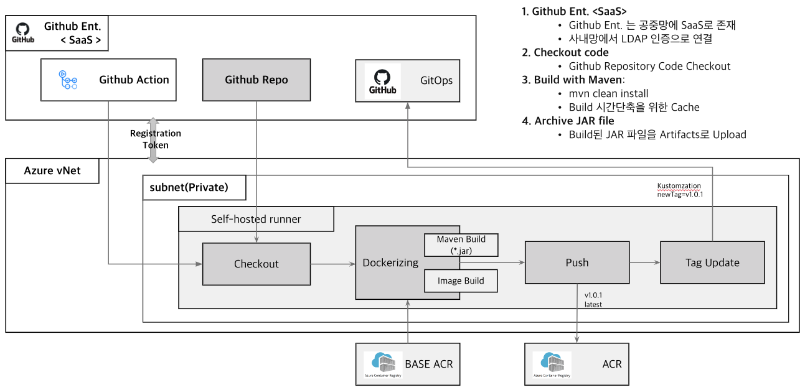

# CICD Basic

지속적 통합(Continuous integration, CI)과 지속적 제공(Continuous delivery or Continuous Deployment, CD), 줄여서 CI/CD는 애플리케이션 개발팀이 더 자주, 안정적으로 코드 변경을 제공하기 위해 사용하는 문화와 운영 원칙 이며 일련의 작업 으로 구성이 된다.

CI/CD는 데브옵스팀을 위한 권장 사항이자 애자일 방법론의 권장 사항이다. CI/CD는 통합과 제공을 자동화함으로써 소프트웨어 개발팀이 코드 품질과 소프트웨어 보안을 보장하는 동시에 비즈니스 요구사항을 충족하는 데 집중할 수 있게 해준다.

# 1. CI

CI(Continuous Integration)는어플리케이션의 새로운 코드 변경 사항이 정기적으로 빌드 및 테스트 되어 공유 레포지토리에 통합히는 것을 의미한다. (가능하다면 하루에 여러번까지)

지속적 통합은 개발팀이 작은 코드 변경을 수시로 구현해 버전 제어 리포지토리(VCR)에 통합하도록 유도하는 코딩 원칙이자 일련의 방식이다.

## 1) CI 특징

* 지속적 통합은 애플리케이션을 빌드, 패키징, 테스트하기 위한 자동화된 방법을 구축
* 일관적인 통합 프로세스를 두면 개발자는 자연스럽게 더 자주 코드 변경을 커밋하게 되고 이것이 더 나은 협업과 코드 품질로 이어짐

- 빠른 피드백 받을 수 있으며 통합시 버그를 빠르게 찾고 해결 가능

- 소프트웨어 품질 향상
- 개발 주기 단축

## 2) CI에 대한 4가지 규칙

주의할 점은 CI 도구를 도입했다고 해서 CI를 하고 있다는 것은 아니다. 마틴 파울러의 블로그에서는 CI에 대해 아래와 같은 4가지 규칙을 이야기한다.

1. 모든 소스코드가 실행가능하며, 모든 사용자가 **가장 최신 소스코드에 접근할 수 있는 단일 지점을 유지**할 것(master,develop)
2. 누구나 **단일 명령을 사용하여 빌드**할 수 있도록 빌드 프로세스를 자동화할 것
3. **단일 명령으로 언제든지 테스트**를 실행할 수 있도록 할 것
4. 누구나 현재 실행 파일을 얻으면 지금까지 가장 완전한 실행 파일을 얻었다는 **확신**을 하게 할 것

# 2. CD

## 1) Continuous Delivery

빌드 자동화와 CI의 단위 및 통합 테스트에 이어 지속적 전달은 **검증된 코드를 리포지토리로 자동 릴리즈**한다. 따라서 효과적인 지속적 전달 프로세스를 갖기 위해서는 CI가 이미 파이프라인으로 구축되어 있어야 한다. 지속적 전달의 목표는 **항상 운영환경에 배포할 준비가 된 코드를 갖는 것**이다.

지속적 전달에서는 코드 병합에서 프로덕션 준비 빌드 제공에 이르기까지 모든 단계에 테스트 자동화 및 코드 릴리스 자동화가 포함된다. 해당 프로세스가 끝나면 운영 팀은 앱을 프로덕션에 빠르고 쉽게 배포할 수 있다.

## 2) Continuous Deployment

성숙한 CI/CD 파이프라인의 마지막 단계는 지속적인 배포이다. 코드 리포지토리에 대한 프로덕션 준비 빌드 릴리스를 자동화하는 지속적 전달의 확장으로서 지속적 배포는 **어플리케이션을 프로덕션으로 릴리즈하는 것을 자동화**한다.

* CD는 CI과정에서 빌드와 테스팅이 완료된 코드를 사용자에게 지속적으로 배포하는 과정을 의미
* Continuous Deployment는 Production 레벨까지 자동으로 deploy
* 완전 자동화된 배포 파이프라인 존재 필요

# 3. CI/CD Flow

Azure 와 Github Action 환경에서 CI와 CD 의 흐름도를 살펴보자.(Container 환경기준)

## CI Flow

Github 에 CI Workflow 와 Source Code 를 보관하며 이를 이용하여 Dockerizing (소스빌드, 이미지 빌드)작업을 수행하여 ACR 에 Push한다.

## CD Flow

ArgoCD를 활용하여 Image 를 AKS에 Deploy한다.

