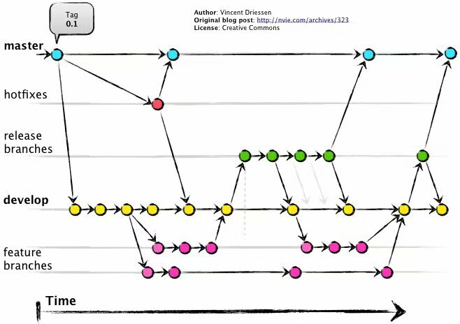

# Git Branch 전략

## Git Flow

깃 플로우는 크게 5개의 브랜치를 만들어 상호 운영되는 전략입니다. 각 브랜치는 고유의 기능이 있습니다. 일부 브랜치는 병합을 통하여 지속적으로 유지되는 브랜치도 있습니다.

 - Master(main)
   - Production에 출시가 가능한 브랜치
   - Master(Main) Branch에서 tag를 만들고 Production에 배포
- Develop
  - 개발이 완료된 최신 브랜치
  - 신규 개발된 내역이 처음 합쳐지는 브랜치
- Feature
  - 각 기능을 개발하는 브랜치
  - 기능 개발 단위로 Feature 브랜치가 생성됨
- Release
  - Develop 브랜치에서 생성됨
  - 개발이 완료되어 출시를 위해 준비하는 브랜치
- Hotfix
  - Production에 배포 된 버전에서 발생한 버그를 수정하는 브랜치
  - 핫픽스 된 부분은 개발 과정에서도 반영이 되야 하므로 Develop 브랜치에도 같이 merge하는 것

## Trunk Based Development

- Trunk Based Development 는 모든 개발자가 하나의 공통된 코드 라인(일반적으로 'trunk' 또는 'main'라고 불림)에서 작업을 진행하는 개발 방식을 말합니다.
- 브랜치 관리에 드는 리소스가 대폭 절약됩니다. 개발자가 각자 자신이 맡은 피쳐 브랜치를 ‘main’ 브랜치와 싱크를 맞추는 것만으로도 충분합니다.
- main브랜치에 코드가 머지되었다면, 먼저 자동화된 CI 시스템이 main브랜치에 대해 테스트 / 통합 과정을 통과하는지 확인합니다. 문제가 없다면, main브랜치의 코드가 그 즉시 운영 환경에 배포할 준비가 됩니다.

## Github Flow

- GitHub Flow는 Trunk-Based Development의 철학을 그대로 따르면서 GitHub의 기능을 적극 활용하여 **효율적인 협업**과 **빠른 배포**를 목표로 합니다.
- GitHub Flow와 Trunk-Based Development의 핵심은  main브랜치의 안정성입니다. main 브랜치는 항상 배포 가능한 상태여야 하며, 어떠한 버그나 불완전한 기능도 포함되어서는 안 됩니다.
- 작업한 브랜치를 main에 병합하기 전에 Pull Request (PR)를 생성하고, 팀원들이 이를 검토합니다. 코드 리뷰를 통해 품질을 유지하며, 버그나 결함을 사전에 방지할 수 있습니다.

## 브랜치 전략별 비교

| 특징        | Git Flow                                     | Trunk Based Development                       | GitHub Flow                         |
| ----------- | -------------------------------------------- | --------------------------------------------- | ----------------------------------- |
| 주요 브랜치 | master, develop, feature, release, hotfix    | main                                          | main                                |
| 개발 흐름   | 선형적인 개발 흐름, 각 기능 별 브랜치 생성   | 하나의 main 브랜치에서 모든 개발 진행         | main 브랜치 중심, Pull Request 기반 |
| 장점        | 안정적인 릴리즈 관리, 복잡한 프로젝트에 적합 | 빠른 배포, 간단한 브랜치 관리                 | 협업 효율성, 품질 보장              |
| 단점        | 복잡한 브랜치 관리, 느린 배포                | 기능 개발 중에 main 브랜치가 불안정할 수 있음 | 빈번한 병합으로 인한 충돌 가능성    |

# Application 버전 관리

## Semantic Versioning

Semantic Versioning은 **MAJOR.MINOR.PATCH** 형식으로 버전을 정의하는 방식입니다.

- **MAJOR**: API에 **호환되지 않는 변경**이 있을 때 증가.
- **MINOR**: 새로운 기능이 추가되지만 **호환성은 유지**될 때 증가.
- **PATCH**: **버그 수정** 등 **기능은 변화하지 않지만 개선**이 이루어질 때 증가.

### Semantic Versioning 예시

- 1.0.0: 초기 릴리즈
- 1.1.0: 새로운 기능 추가
- 2.0.0: 호환되지 않는 변경 (예: API 변경)
- 1.0.1: 버그 수정

## Date-based versioning

- **릴리스된 날짜 혹은 빌드타임**를 기준으로 버전을 지정하는 방식입니다. 
- 주로 릴리스 주기가 **정기적**이거나 **빈번한 릴리스**가 요구되는 프로젝트에서 사용됩니다. 
- 이 방식은 각 버전이 **릴리스된 시점**을 명확히 나타내므로, **배포 주기**가 짧거나 **신속한 업데이트**가 중요한 경우에 적합합니다.

# Container Image Tag 관리 전략

- Image tagging 전략도 Application 버전과 동일하게 Semantic Versioning과 Date-based versioning 방식을 많이 사용합니다. 
- 하지만 브랜치 전략이 Trunk based 혹은 Github flow 같은 1개의 이미지로 여러 환경에 배포할땐, 운영환경에 배포될 별도의 이미지관리가 필요합니다. 

## Release Branch 를 이용한 관리

- main branch 에서 release branch로 병합될때 CI가 수행되어 docker tagging 하는 전략입니다.
- latest 외의 다른 방식으로 tagging 하는 방식으로 합니다.
- 예를 들어 "application-name:release241010" 과 같은 방식으로, relase 에 대한 정보를 태그에 포함해 운영환경에 배포된 이미지를 구분/관리 합니다.
- 장점: 릴리즈 단위로 이미지를 관리하기 용이함, 운영 환경별 이미지를 명확하게 구분
- 단점: 브랜치 관리가 추가적으로 필요

## Git tag 를 이용한 관리

- Git tag 가 Push 되면 이때, CI 를 수행해 Docker 이미지의 태깅을 하는 방법입니다.
- Release 브랜치와 차이점은,release 브랜치에 머지하지 않고 Git tag만으로 관리하는 점입니다.
- 장점: 간단한 관리, Git을 통해 릴리즈 시점을 명확히 알 수 있음
- 단점: 이미지 태그가 많아질 경우 관리가 어려울 수 있음