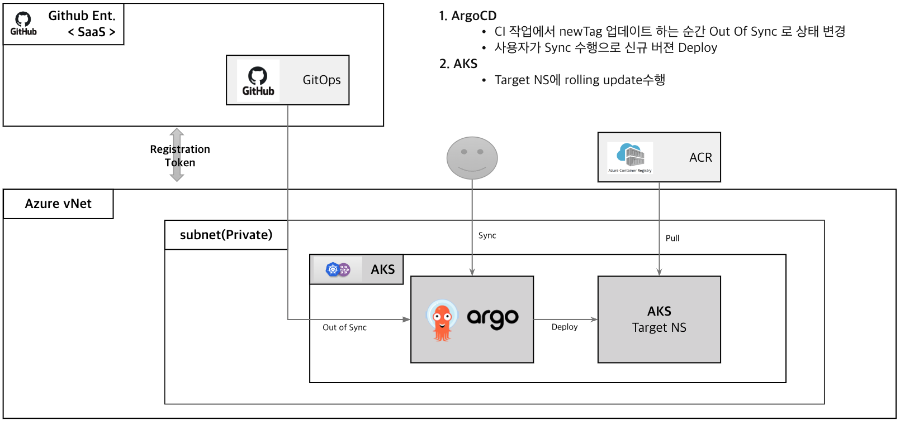

# CICD Basic

# 1. CI (Continuous Integration, 지속적 통합)

개발자들이 코드 변경사항을 주기적으로 메인 브랜치에 병합하는 프로세스

주요 특징:

- 자동화된 빌드 및 테스트
- 빠른 피드백 루프
- 통합 문제의 조기 발견s

이점: 

- 버그를 빠르게 찾고 해결
- 소프트웨어 품질 향상
- 개발 주기 단축

# 2. CD (Continuous Delivery/Deployment)

## 1) Continuous Delivery

정의: 소프트웨어를 언제든지 안정적으로 릴리스할 수 있는 상태로 유지하는 것

특징:

- 자동화된 릴리스 프로세스
- 수동 승인 후 프로덕션 배포

## 2) Continuous Deployment

정의: 코드 변경사항을 자동으로 프로덕션에 배포하는 것

특징:

- 완전 자동화된 배포 파이프라인
- 수동 개입 없이 프로덕션 배포

이점:

- 더 빠른 릴리스 주기
- 리스크 감소
- 고객 피드백의 빠른 반영

# 3. CI/CD 파이프라인

일반적인 단계:

- 코드 커밋
- 빌드
- 자동화된 테스트 (단위 테스트, 통합 테스트 등)
- 아티팩트 생성
- 스테이징 환경 배포
- 승인 (자동 또는 수동)
- 프로덕션 배포

도구 및 플랫폼

Jenkins, GitLab CI, GitHub Actions, CircleCI, Travis CI, ArgoCD

도입 시 고려사항

- 팀 문화와 프로세스 변화
- 인프라 자동화
- 테스트 자동화
- 모니터링 및 로깅

CI/CD는 소프트웨어 개발 프로세스를 더욱 효율적이고 안정적으로 만들어주는 핵심 방법론입니다. 이를 통해 개발팀은 더 빠르게, 더 자주, 더 안정적으로 소프트웨어를 제공할 수 있습니다

[[_TOSP_]]

## CI

## CD

- ArgoCD를 활용한 Image Deploy

