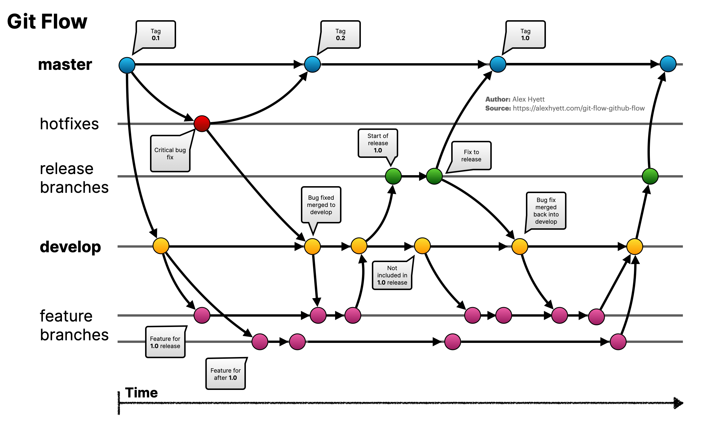

# 1. Git Branch 전략

**Git Branch 전략**은 소프트웨어 개발 과정에서 여러 명의 개발자가 동시에 작업할 수 있도록 코드를 분리하고 병합하는 방식을 정의하는 방법이다. 이를 통해 기능 개발, 버그 수정, 릴리즈 준비 등의 작업을 명확하게 구분할 수 있다. 이 Branch 전략이 중요한 이유는 코드 변경 관리의 효율성을 높이고, 병합 충돌을 줄이며, 안정적인 릴리즈를 보장할 수 있기 때문이다. 잘 설계된 브랜치 전략은 팀의 생산성을 높이고 코드 품질을 유지하는 데 중요한 역할을 한다.

* **Git Flow**: 기능별로 브랜치를 만들고, 개발(develop)과 마스터(master) 브랜치를 분리하여 다양한 기능 개발과 안정적인 릴리즈를 동시에 진행할 수 있도록 설계된 워크플로우

* **GitHub Flow**: 마스터 브랜치 중심으로 모든 기능을 브랜치에서 개발하고, 완료되면 즉시 병합하는 단순한 방식으로, 지속적인 배포 환경에 적합

이 두 가지 전략은 개발 팀의 규모와 프로젝트 요구사항에 따라 선택적으로 사용된다.

## 1) Git Flow

Git Flow는 크게 5개의 브랜치를 만들어 상호 운영되는 전략이다. 각 브랜치는 고유의 기능이 있다. 일부 브랜치는 병합을 통하여 지속적으로 유지되는 브랜치도 있다.

### (1) 브랜치 종류

 - Master(main)
   - 현재 릴리즈된 코드의 저장소임. 언제든지 Production에 출시가 가능한 브랜치
   - Master(Main) Branch에서 tag를 만들고 Production에 배포
- Develop
  - Master 로 부터 브랜치를 분기하여 추가 개발사항을 반영
  - 신규 개발된 내역이 처음 합쳐지는 브랜치
- Feature
  - 새로운 단위 기능을 개발하기 위해 Develop로 부터 브랜치를 분기, 
  - feature라는 단일 브랜치가 있는건 아니고 변경건이 존재할 때마나 생성
  - 기능 개발 단위로 Feature 브랜치가 생성됨
- Release
  - Develop 브랜치에서 생성됨
  - 개발이 완료되어 출시를 위해 준비하는 브랜치
  - 릴리즈 이후 Master/Develop 으로 Merge 됨
- Hotfix
  - Production에 배포 된 버전에서 발생한 버그를 수정하는 브랜치
  - 핫픽스 된 부분은 개발 과정에서도 반영이 되야 하므로 Develop 브랜치에도 같이 Merge함

### (2) Flow

## 2) Github Flow

프로젝트 규모나 수준을 고려하여 Git Flow 사용이 복잡할 경우 좀더 가볍게 적용할 수 브랜치 전략이다. Hotfix/Feature 브랜치를 구분하지 않으며 수시로 배포가 일어나는 프로젝트에 유용하다.

### (1) 브랜치 종류

Github Flow 브랜치 전략은 총 2개의 브랜치로 나누어진다.

* Master(Main)
  * Gif Flow 와 유사함, 현래 릴리즈된 코드의 저장소
  * 언제든 배포가능한 상태의 코드를 저장함
* Feature
  * 새로운 기능 개발을 위한 브랜치이며 Master 브랜치에서 분기
  * 개발이 완료되면 Master 브랜체로 Merge 함

### (2) Flow

### (3) 특징

- Github Flow 에서는 Master 브랜치 하나로 개발/운영 환경을 모두 관리한다.
- 변경사항이 Master 로 병합되기전에 코드리뷰와 테스트를 통과해야 한다.
- Github Flow 는 규모가 작은 팀이나 지속적으로 빠르게 배포해야 하는 서비스에 적합하다.

## 3) 브랜치 전략별 비교

| 특징        | Git Flow                                     | GitHub Flow                         |
| ----------- | -------------------------------------------- | ----------------------------------- |
| 주요 브랜치 | master, develop, feature, release, hotfix    | master, feature                     |
| 개발 흐름   | 선형적인 개발 흐름, 각 기능 별 브랜치 생성   | main 브랜치 중심, Pull Request 기반 |
| 장점        | 안정적인 릴리즈 관리, 복잡한 프로젝트에 적합 | 협업 효율성, 품질 보장, 빠른 배포   |
| 단점        | 복잡한 브랜치 관리, 느린 배포                | 빈번한 병합으로 인한 충돌 가능성    |

# 2. Application Versioning

Application 빌드시 필요한 Versioning은 아래와 같이 2가지 방식이 주로 많이 사용된다.

## 1) Semantic Versioning

### (1) 구조

Semantic Versioning은 **MAJOR.MINOR.PATCH** 형식으로 버전을 정의하는 방식이다.

- **MAJOR**: API에 **호환되지 않는 변경**이 있을 때 증가.
- **MINOR**: 새로운 기능이 추가되지만 **호환성은 유지**될 때 증가.
- **PATCH**: **버그 수정** 등 **기능은 변화하지 않지만 개선**이 이루어질 때 증가.

### (2) 예시

- 1.0.0: 초기 릴리즈
- 1.1.0: 새로운 기능 추가
- 2.0.0: 호환되지 않는 변경 (예: API 변경)
- 1.0.1: 버그 수정

## 2) Datetime-based versioning

- **릴리스된 날짜 혹은 빌드타임**를 기준으로 버전을 지정하는 방식이다. 
- 주로 릴리스 주기가 **정기적**이거나 **빈번한 릴리스**가 요구되는 프로젝트에서 사용된다. 
- 이 방식은 각 버전이 **릴리스된 시점**을 명확히 나타내므로, **배포 주기**가 짧거나 **신속한 업데이트**가 중요한 경우에 적합하다.

### (1) 예시

* 202410011255
* 202410301310

# 3. Container Image Tagging

Image tagging 전략도 Application 버전과 동일하게 Semantic Versioning과 Date-based versioning 방식을 많이 사용한다.  하지만 브랜치 전략이 Github flow 같은 1개의 이미지로 여러 환경에 배포할땐, 운영환경에 배포될 별도의 이미지 관리가 필요하다.

## 1) Release Branch를 이용한 관리

- develop branch에서 운영 배포를 위해 release branch가 발생하고 이 branch에서 CI가 수행되어 docker tagging을 하는 전략이다.
- 예를 들어 release branch 명이 rel-v1.1.1 라고 한다면 "application-name:rel-v1.1.1" 과 같은 방식으로 Image Tag를 생성한다.
- 이와 같이 relase에 대한 정보를 태그에 포함해 운영환경에 배포된 이미지를 구분하고 관리할 수 있다.
- 장점
  - 릴리즈 단위로 이미지를 관리하기 용이함, 운영 환경별 이미지를 명확하게 구분

- 단점
  - 브랜치 관리가 추가적으로 필요

## 2) Datetime-based versioning

* 주로 개발환경에서 빠르게 배포되어야 할때 사용하는 tagging 전략이다.

- 일반적으로 develop barnch 의 경우는 특정 version 이 명시되지 않는 상태로 유지하고 개발 진행중인 상태에서 CI 가 수행될 경우 Datetime 으로 tag 를 생성한다.

- 장점
  - 간단한 관리, tagging 시점을 명확히 알 수 있음
- 단점
  - 이미지 태그가 많아질 경우 관리가 어려울 수 있음