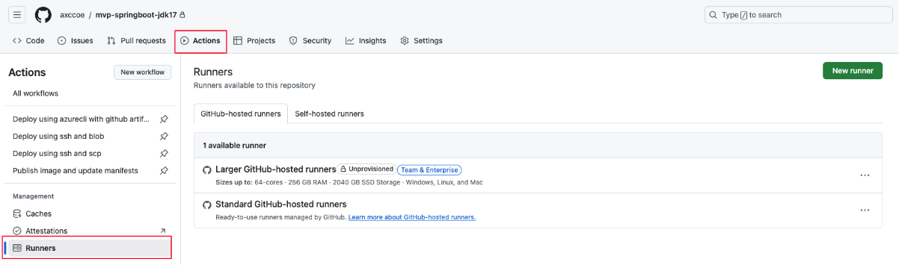
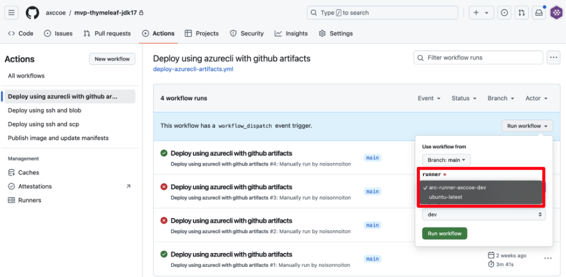

[[_TOC_]]

# Actions Runner


# 1. 개요

Actions Runner는 Github Actions의 workflow에서 정의한 Job을 실행하는 환경이자 애플리케이션을 의미합니다. Github-hosted Runner 또는 self-hosted Runner를 통해 구성할 수 있으며 아래 3가지 옵션을 고려할 수 있다.

* 무료 Hosted Agent

* 유료 Hosted Agent
* Self-hosted Agent


# 2. Github-hosted Runner

Github-hosted Runner는 Github가 제공하는 workflow를 실행하기 위한 가상 머신입니다. 가상머신에는 Github Actions에서 사용할 수 있는 도구, 패키지 및 환경이 포함되어 있습니다.

**주요 특징** 


| 구분               | 설명                                                         |
| ------------------ | ------------------------------------------------------------ |
| 운영체제 지원      | Ubuntu, Windows, macOS 운영체제 사용 가능                    |
| 자동 유지관리      | Github에서 서버 유지 관리 및 업그레이드 자동 수행            |
| 비용               | Public Repository 무료, Private Repository는 일정량 무료 후 추가 요금 발생 |
| 리소스 제한        | 워크플로우 최대 6시간 실행, CPU 및 메모리 제한               |
| 네트워크 요구사항  | 최소 70kbps의 네트워크 속도 요구                             |
| VM 생성 및 삭제    | 각 Job 실행 시 VM이 자동 생성되고 완료 후 자동 삭제          |
| 클라우드 환경      | Microsoft Azure 클라우드 환경에서 실행                       |
| Larger Runner 지원 | Github Team 및 Github Enterprise 플랜에서 더 많은 리소스를 가진 VM 제공 |

   

   

**Repository에서 사용 가능한 Runner 확인하기**


<br> 
**Github-hosted Runner 사용하기**

> 

1. workflow 작성 시 job을 만들고, runs-on을 통해 job을 처리할 runner 유형을 지정합니다.

```jsx
on:
  workflow_dispatch:
    inputs:
      runner:
        required: true
        options:
          - ubuntu-latest  # Github-hosted Runner

jobs:
  build:
    runs-on: "${{ inputs.runner }}"  # 선택된 GitHub-hosted Runner에 따라 실행
```

2. Job이 시작되면, github는 해당 Job에 대한 새 vm을 자동으로 프로비저닝합니다.
3. Job이 실행되는 동안 로그와 Output을 Github UI에서 확인할 수 있습니다.
   

4. job이 완료되면 vm이 자동으로 삭제됩니다.

<br> 

# 2. Self-hosted Runner

Github가 제공하는 기본 호스팅 환경 대신, 사용자가 직접 구성한 환경(서버, VM, 컨테이너 등)에서 workflow를 실행할 수 있도록 설정한 Runner입니다. 사용자는 Runner가 설치된 하드웨어와 소프트웨어에 대해 완전히 제어가 가능하며, 사용자의 요구사항에 맞춰 환경을 구성할 수 있습니다.

관리 계층의 다양한 레벨에서 self-hosted runner를 추가할 수 있습니다.

- repository 수준의 runner는 단일 repository에 종속적입니다.
- Org. 수준의 Runner는 org 내 여러 repository에 대한 job을 처리할 수 있습니다.
- Enterprise 수준의 Runner는 Enterprise 계정 내의 여러 Org에 할당될 수 있습니다.

**주요 특징** 

| 구분          | 설명                                                         |
| ------------- | ------------------------------------------------------------ |
| 운영체제 지원 | 사용자가 선택한 하드웨어 및 운영체제(예: Linux, Windows, macOS)에서 실행 가능 |
| 서버 유지관리 | 사용자가 직접 서버 유지관리, 보안 패치 및 소프트웨어 업그레이드를 수행해야 함 |
| 비용          | Github Actions 자체 비용은 없으나, 관리하는 머신이나 클라우드 자원에 대한 비용 발생 |
| Auto Scaling  | 자체 확장 기능을 설정하거나, ARC 등을 통해 자동 스케일링 가능 |
| 스크립트 실행 | Job 실행 전후로 Bash, PowerShell 스크립트를 실행할 수 있음   |
| 컨테이너 지정 | job에 사용되는 컨테이너를 지정할 수 있음                     |
| 서비스 구성   | self-hosted runner 애플리케이션을 서비스로 구성하여 머신 시작 시 자동으로 시작되도록 설정 가능 |


 

**Self-hosted Runner 추가 예시**

Repo, Org, Enterprise에 Self-hosted Runner를 추가할 수 있습니다. 그 중 Repository에 Self-hosted Runner를 추가하는 방법을 알아보겠습니다. 

1. Selft-hosted Runner로 사용할 머신을 준비
2. Github에서 Repository의 메인 페이지로 이동하여 Setting을 클릭
3. 왼쪽 사이드바에서 Actions > Runners를 클릭

4. New Self-hosted Runner 클릭 


5. Self-hosted Runner 머신의 OS 이미지와 Architecture를 선택
    

6. 머신에서 Runner 애플리케이션을 다운로드하고 실행하는 Shell Script를 실행
7. 터미널에서 다음 메시지를 확인함으로써 성공적으로 Runner가 추가되었는지  확인


## 2.1 Service로 Self-Hosted Runner Application 구성

셀프 호스팅 러너 애플리케이션을 서비스로 구성하여, 머신이 시작될 때 러너 애플리케이션을 자동으로 시작할 수 있습니다. (Service daemon과 같이 백그라운드에서 실행되는 프로세스)

Systemd를 사용하는 Linux시스템의 경우, 성공적으로 Self-hosted Runner를 추가한 후 생성되는 [svc.sh](http://svc.sh) 스크립트를 통해 Runner Application을 service로 설치하고 관리할 수 있습니다.  

Runner Machine에 self-hosted runner 애플리케이션을 설치한 Directory에서 shell을 열고 아래 명령을 사용하여 Service를 설치하고 관리합니다. 

**Service 설치  및 관리**

```jsx
# Service 설치
1. 현재 실행 중인 application 중지
2. sudo ./svc.sh install

# Service 시작
sudo ./svc.sh start

# Service 상태 확인
sudo ./svc.sh status

# Service 중지 
sudo ./svc.sh stop

# Service 제거
1. 현재 실행 중인 서비스 중지
2. sudo ./svc.sh uninstall
```

## 2.2 Actions Runner Controller

Actions Runner Controller (ARC)는 Kubernetes 클러스터에서 Self-hosted Runner를 자동으로 배포, 관리, 그리고 확장하는 도구입니다. AKS 환경에서 GitHub Actions Runner를 관리하는 데 사용됩니다.

**2.2.1 Actions Runner Controller 구성 요소**
ARC는 Kubernetes 클러스터에서 GitHub Actions Self-hosted Runner를 관리하고 확장하는 데 필요한 여러 리소스와 기능을 제공합니다. ARC는 Kubernetes 환경 내에서 자동 스케일링과 효율적인 리소스 관리를 지원하며, 각 리소스는 Helm 차트를 통해 배포됩니다. 

- Controller 리소스
  - gha-runner-scale-set-controller: Runner 배포와 스케일링을 관리하는 핵심 리소스입니다. 이 리소스는 ReplicaSet과 Pod를 포함하며, 컨트롤러 매니저 역할을 수행합니다. deployment.yaml 파일을 통해 설정되는 리소스 입니다.
- 서비스 계정 및 권한 리소스
  - SeviceAccount : ARC는 각 Runner에 대한 권한을 관리하기 위해 ServiceAccount를 생성합니다. 이를 통해 각 Runner가 필요한 권한으로 Kubernetes API 및 GitHub API에 접근할 수 있습니다.
  - ClusterRole 및 RoleBinding: ClusterRole 및 RoleBinding은 Runner가 Kubernetes 클러스터에서 필요한 리소스에 접근하고 제어할 수 있도록 권한을 설정하는 리소스입니다.
- 자동 스케일링 리소스
  - AutoscalingRunnerSet: ARC는 자동으로 Runner의 수를 조정할 수 있으며, AutoscalingRunnerSet 리소스를 통해 트래픽 및 작업량에 따라 Runner의 수를 자동으로 조정해주는 리소스입니다. Runner 집합을 효율적으로 관리합니다.
- CustomResourceDefinition(CRD): ARC에서 사용되는 Runner 관리 리소스는 Kubernetes 기본 리소스가 아닌, CRD를 통해 정의된 사용자 지정 리소스입니다. 이 CRD는 'RunnerDeployment', 'AutoscalingRunnerSet'등의 형태로 Runner의 배포와 확장을 관리합니다.

**2.2.2 Actions Runner Controller CustomResourceDefinition(CRD) 유형**

**1. Autoscaling Runner** 

- 특징 : 자동으로 Runner 수를 조정하는 기능을 제공하며, 트래픽이나 워크플로우 작업 수에 따라 Runner가 자동으로 생성되거나 삭제됩니다.
- 배포 방법 : AutoscalingRunnerSet 리소스를 사용하여 설정하며, 최소 및 최대 Runner 수, 스케일링 조건을 지정할 수 있습니다.

~~~yaml
apiVersion: actions.github.com/v1alpha1
kind: AutoscalingRunnerSet
metadata:
  name: autoscaling-runner
  namespace: arc-system
spec:
  githubConfigUrl: https://github.com/your-org/your-repo
  githubConfigSecret:
    name: controller-manager
  minRunners: 1
  maxRunners: 10
  template:
    spec:
      repository: "your-org/your-repo"
      labels:
        - self-hosted
        - ubuntu
~~~


**2. Ephemeral Runner**

- 특징 : 각 작업이 완료되면 Runner가 자동으로 삭제되는 임시 Runner입니다. 보안 및 리소스 관리 측면에서 사용하기 유용합니다.
- 배포 방법 : EphemeralRunner 리소스를 사용하여 설정하며, 특정 작업을 처리한 후 자동으로 삭제되므로 관리하기 편리합니다.

~~~yaml
apiVersion: actions.github.com/v1alpha1
kind: EphemeralRunner
metadata:
  name: ephemeral-runner
  namespace: arc-system
spec:
  githubConfigUrl: https://github.com/your-org/your-repo
  githubConfigSecret:
    name: controller-manager
  labels:
    - self-hosted
    - ephemeral
~~~


**2.2.3 ARC 설치 및 Runner 배포 단계**

```jsx
# Helm 차트 추가
helm repo add actions-runner-controller https://actions-runner-controller.github.io/actions-runner-controller

# ARC 설치
kubectl create namespace actions-runner-system
helm install --namespace actions-runner-system actions-runner-controller actions-runner-controller/actions-runner-controller

# Github 인증 설정
kubectl create secret generic controller-manager -n actions-runner-system --from-literal=github_token=<YOUR_PAT>

# Runner 적용
kubectl apply -f runner-deployment.yaml
```

ARC가 설치된 후, Runner를 배포하여 GitHub Actions 워크플로우에서 사용할 수 있습니다. Self-hosted-Runner를 설정하는 yaml파일을 작성하고 적용합니다. 

### Runner 배포 예시파일

고정된 Runner를 배포하는 RunnerDeployment 유형을 사용합니다. CRD 두가지 유형과 달리, 고정된 수의 Runner를 유지합니다.

~~~yaml
apiVersion: actions.summerwind.dev/v1alpha1
kind: RunnerDeployment
metadata:
  name: arc-runner-deployment
  namespace: arc-system
spec:
  replicas: 2
  template:
    spec:
      repository: "your-org/your-repo"
      labels:
        - self-hosted
        - ubuntu
~~~

**ARC 상태 확인**

```jsx
kubectl get all -n arc-system
# 현재 상태
NAME                                          READY   STATUS    RESTARTS   AGE
pod/arc-gha-rs-controller-5d5ccf54f5-dnsvd    1/1     Running   0          15h
pod/arc-runner-axccoe-dev-67d9c88b-listener   1/1     Running   0          3h7m

NAME                                    READY   UP-TO-DATE   AVAILABLE   AGE
deployment.apps/arc-gha-rs-controller   1/1     1            1           2d23h

NAME                                               DESIRED   CURRENT   READY   AGE
replicaset.apps/arc-gha-rs-controller-5d5ccf54f5   1         1         1       2d23h

```


# Actions Runner 사용 예시
runner: Option 선택 환경을 통해 Github-hosted Runner와 Self-hosted Runner를 선택합니다.

- Github-hosted Runner : ubuntu-latest (자동 관리 VM)
- Self-hosted Runner : arc-runner-axccoe-dev (사용자 설정 Runner)


워크플로우 예시 파일

~~~yaml
on:
  workflow_dispatch:
    inputs:
      runner:
        required: true
        type: choice
        options:
          - ubuntu-latest  # Github-hosted Runner
          - arc-runner-axccoe-dev  # Self-hosted Runner
      environment:
        description: "Deployment environment"
        required: true
        default: "dev"
        type: choice
        options:
        - dev
        - prd

jobs:
  build:
    name: (${{ inputs.environment }}) Build using maven
    runs-on: "${{ inputs.runner }}"  # 선택된 Runner에 따라 실행
~~~

1. Repository 내 Actions > workflow 선택 > Run workflow 에서 runner 를 선택합니다.
   

2. 선택한 Runner에 따라 Workflow가 실행됩니다.
   