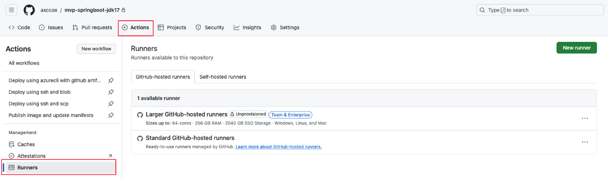
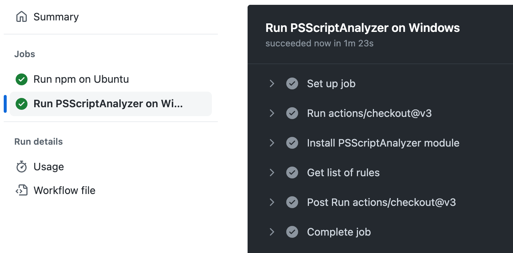
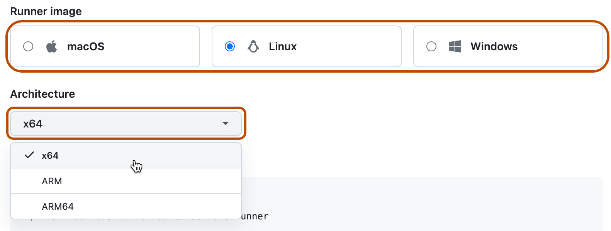

[[_TOC_]]

# Actions Runner


# 1. 개요

Actions Runner는 Github Actions의 workflow에서 정의한 Job을 실행하는 환경이자 애플리케이션을 의미한다. Github-hosted Runner 또는 Self-hosted Runner를 통해 구성할 수 있으며 아래와 같은 runner 들이 존재한다.

* Github-hjosted Agent

* Self-hosted Agent
  * VM
  * ARC ( Kubernetes 기반)


# 2. Github-hosted Runner

Github-hosted Runner는 Github가 제공하는 workflow를 실행하기 위한 가상 머신이다. 가상머신에는 Github Actions에서 사용할 수 있는 도구, 패키지 및 환경이 포함되어 있다.

**주요 특징** 


| 구분               | 설명                                                         |
| ------------------ | ------------------------------------------------------------ |
| 운영체제 지원      | Ubuntu, Windows, macOS 운영체제 사용 가능                    |
| 자동 유지관리      | Github에서 서버 유지 관리 및 업그레이드 자동 수행            |
| 비용               | Public Repository 무료, Private Repository는 일정량 무료 후 추가 요금 발생 |
| 리소스 제한        | 워크플로우 최대 6시간 실행, CPU 및 메모리 제한               |
| 네트워크 요구사항  | 최소 70kbps의 네트워크 속도 요구                             |
| VM 생성 및 삭제    | 각 Job 실행 시 VM이 자동 생성되고 완료 후 자동 삭제          |
| 클라우드 환경      | Microsoft Azure 클라우드 환경에서 실행                       |
| Larger Runner 지원 | Github Team 및 Github Enterprise 플랜에서 더 많은 리소스를 가진 VM 제공 |

   

   

**Repository에서 사용 가능한 Runner 확인하기**




**Github-hosted Runner 사용하기**

1. workflow 작성 시 job을 만들고, runs-on을 통해 job을 처리할 runner 유형을 지정한다.

```jsx
on:
  workflow_dispatch:
    inputs:
      runner:
        required: true
        options:
          - ubuntu-latest  # Github-hosted Runner

jobs:
  build:
    runs-on: "${{ inputs.runner }}"  # 선택된 GitHub-hosted Runner에 따라 실행
```

2. Job이 시작되면, github는 해당 Job에 대한 새 vm을 자동으로 프로비저닝한다.
3. Job이 실행되는 동안 로그와 Output을 Github UI에서 확인할 수 있다.
   

4. job이 완료되면 vm이 자동으로 삭제됩니다.


 

# 3. Self-hosted Runner

Github가 제공하는 기본 호스팅 환경 대신, 사용자가 직접 구성한 환경(서버, VM, 컨테이너 등)에서 workflow를 실행할 수 있도록 설정한 Runner이다. 사용자는 Runner가 설치된 하드웨어와 소프트웨어에 대해 완전히 제어가 가능하며, 사용자의 요구사항에 맞춰 환경을 구성할 수 있다.

관리 계층의 다양한 레벨에서 self-hosted runner를 추가할 수 있다.

- repository 수준의 Runner는 단일 repository에 종속적이다.
- Org. 수준의 Runner는 org 내 여러 repository에 대한 job을 처리할 수 있다.
- Enterprise 수준의 Runner는 Enterprise 계정 내의 여러 Org에 할당될 수 있다.

**주요 특징** 

| 구분          | 설명                                                         |
| ------------- | ------------------------------------------------------------ |
| 운영체제 지원 | 사용자가 선택한 하드웨어 및 운영체제(예: Linux, Windows, macOS)에서 실행 가능 |
| 서버 유지관리 | 사용자가 직접 서버 유지관리, 보안 패치 및 소프트웨어 업그레이드를 수행해야 함 |
| 비용          | Github Actions 자체 비용은 없으나, 관리하는 머신이나 클라우드 자원에 대한 비용 발생 |
| Auto Scaling  | 자체 확장 기능을 설정하거나, ARC 등을 통해 자동 스케일링 가능 |
| 스크립트 실행 | Job 실행 전후로 Bash, PowerShell 스크립트를 실행할 수 있음   |


# 4. [SHR] VM 기반 Runner

 

## 1) Self-hosted Runner 추가

Repo, Org, Enterprise에 Self-hosted Runner를 추가할 수 있다. 그 중 Repository에 Self-hosted Runner를 추가하는 방법을 알아보자.


### (1) self-hosted runner 추가

1. Selft-hosted Runner로 사용할 머신을 준비
2. Github에서 Repository의 메인 페이지로 이동하여 Setting을 클릭
3. 왼쪽 사이드바에서 Actions > Runners를 클릭

4. New Self-hosted Runner 클릭 


5. Self-hosted Runner 머신의 OS 이미지와 Architecture를 선택
    
6. 머신에서 Runner 애플리케이션을 다운로드하고 실행하는 Shell Script를 실행


### (2) VM 설정

신규 VM에서 github web page 가이드 문서에 따라 설정작업을 진행한다.

#### Download

```sh
# Create a folder
$ mkdir ~/actions-runner
  cd ~/actions-runner

# Download the latest runner package
$ curl -o actions-runner-linux-x64-2.319.1.tar.gz -L https://github.com/actions/runner/releases/download/v2.319.1/actions-runner-linux-x64-2.319.1.tar.gz


# Optional: Validate the hash
$ echo "3f6efb7488a183e291fc2c62876e14c9ee732864173734facc85a1bfb1744464  actions-runner-linux-x64-2.319.1.tar.gz" | shasum -a 256 -c


# Extract the installer
$ tar xzf ./actions-runner-linux-x64-2.319.1.tar.gz

$ ll
total 213968
drwxr-xr-x 4 song song      4096 Aug 13 16:29 ./
drwxrwxr-x 3 song song      4096 Aug 23 15:12 ../
-rw-rw-r-- 1 song song 219048621 Aug 23 15:12 actions-runner-linux-x64-2.319.1.tar.gz
drwxr-xr-x 5 song song     16384 Aug 13 16:29 bin/
-rwxr-xr-x 1 song song      2458 Aug 13 16:29 config.sh*
-rwxr-xr-x 1 song song       646 Aug 13 16:29 env.sh*
drwxr-xr-x 6 song song      4096 Aug 13 16:29 externals/
-rw-r--r-- 1 song song      1619 Aug 13 16:29 run-helper.cmd.template
-rwxr-xr-x 1 song song      2663 Aug 13 16:29 run-helper.sh.template*
-rwxr-xr-x 1 song song      2535 Aug 13 16:29 run.sh*
-rwxr-xr-x 1 song song        65 Aug 13 16:29 safe_sleep.sh*


```


#### Configure

```sh

$ ./config.sh --url https://github.com/rohansong/SampleJava --token BL3CINY5W3ANSDHQ5A6MMYDHAFJ7A

--------------------------------------------------------------------------------
|        ____ _ _   _   _       _          _        _   _                      |
|       / ___(_) |_| | | |_   _| |__      / \   ___| |_(_) ___  _ __  ___      |
|      | |  _| | __| |_| | | | | '_ \    / _ \ / __| __| |/ _ \| '_ \/ __|     |
|      | |_| | | |_|  _  | |_| | |_) |  / ___ \ (__| |_| | (_) | | | \__ \     |
|       \____|_|\__|_| |_|\__,_|_.__/  /_/   \_\___|\__|_|\___/|_| |_|___/     |
|                                                                              |
|                       Self-hosted runner registration                        |
|                                                                              |
--------------------------------------------------------------------------------

# Authentication


√ Connected to GitHub

# Runner Registration

Enter the name of the runner group to add this runner to: [press Enter for Default]

Enter the name of runner: [press Enter for eduVM]

This runner will have the following labels: 'self-hosted', 'Linux', 'X64'
Enter any additional labels (ex. label-1,label-2): [press Enter to skip]

√ Runner successfully added
√ Runner connection is good

# Runner settings

Enter name of work folder: [press Enter for _work]

√ Settings Saved.


# Last step, run it!
$ ./run.sh
```

마지막 run.sh 수행은 forground 방식이다.  

background 방식으로 수행시에는 아래를 참고 한다.


#### [참고] background 로 실행

```	sh
# 1) Service 설치
sudo ./svc.sh install

# Service 시작
sudo ./svc.sh start

# Service 상태 확인
sudo ./svc.sh status

# Service 중지 
sudo ./svc.sh stop

# Service 제거
sudo ./svc.sh uninstall

```


### (3) Workflow 에서 사용

```sh

# Use this YAML in your workflow file for each job
runs-on: self-hosted

```


## 2) Clean Up

```sh
# 삭제시...

# Service 중지
sudo ./svc.sh stop


# 해당 파일 삭제
$ rm -rf ~/actions-runner

```


# 5. [SHR] Actions Runner Controller

Actions Runner Controller (ARC)는 Kubernetes 클러스터에서 Self-hosted Runner를 자동으로 배포, 관리, 그리고 확장하는 도구이다. AKS 환경에서 GitHub Actions Runner를 관리하는 데 사용된다.

VM 기반의 Runner 와 비교했을때 다양한 장점이 존재한다.


## 1) ARC 사용 장점

**비용효율성**

단일 인스턴스에 설치하여 가상 머신(VM)을 기반으로 한 오토 스케일링 방법은 가상 머신을 오버 프로비저닝하여 리소스 낭비를 초래하거나 가상 머신을 언더 프로비저닝하여 빌드 속도를 늦추고 개발자 경험(DX)을 저하할 수도 있다. ARC를 사용하게 되면 각 Runner 파드마다 워크플로 성격별로 최적화된 리소스를 할당해 비용 효율적으로 운영할 수 있다.

**확장성**

ARC에서는 쿠버네티스의 강력한 기능을 활용하여 워크로드 할당량에 따라 러너 파드를 자동으로 확장한다. 이렇게 하면 러너 리소스를 낭비하지 않고 인프라를 보다 효율적으로 사용할 수 있다.

**속도**

ARC에서는 항상 일정한 수의 대기 상태의 러너 파드를 유지하도록 구성할 수 있다. 뿐만 아니라 쿠버네티스는 요청에 따라 새로운 러너 파드를 상당히 빠르게 할당할 수도 있다. 이러한 이유들로 러너가 Pending 상태의 시간이 거의 없으므로 많은 워크플로가 더 빠르게 실행될 수 있다.


## 2) ARC 구성 요소
ARC는 Kubernetes 클러스터에서 GitHub Actions Self-hosted Runner를 관리하고 확장하는 데 필요한 여러 리소스와 기능을 제공한다. ARC는 Kubernetes 환경 내에서 자동 스케일링과 효율적인 리소스 관리를 지원하며, 각 리소스는 Helm 차트를 통해 배포된다. 

* CustomResourceDefinition(CRD)
  * ARC에서 사용되는 Runner 관리 리소스는 Kubernetes 기본 리소스가 아닌, CRD를 통해 정의된 사용자 지정 리소스이다. 이 CRD는 'RunnerDeployment', 'AutoscalingRunnerSet'등의 형태로 Runner의 배포와 확장을 관리한다.

- Controller 리소스
  - gha-runner-scale-set-controller: Runner 배포와 스케일링을 관리하는 핵심 리소스이다. 이 리소스는 ReplicaSet과 Pod를 포함하며, 컨트롤러 매니저 역할을 수행한다. deployment.yaml 파일을 통해 설정되는 리소스 이다.
- 서비스 계정 및 권한 리소스
  - SeviceAccount : ARC는 각 Runner에 대한 권한을 관리하기 위해 ServiceAccount를 생성한다. 이를 통해 각 Runner가 필요한 권한으로 Kubernetes API 및 GitHub API에 접근할 수 있다.
  - ClusterRole 및 RoleBinding: ClusterRole 및 RoleBinding은 Runner가 Kubernetes 클러스터에서 필요한 리소스에 접근하고 제어할 수 있도록 권한을 설정하는 리소스이다.
- 자동 스케일링 리소스
  - AutoscalingRunnerSet: ARC는 자동으로 Runner의 수를 조정할 수 있으며, AutoscalingRunnerSet 리소스를 통해 트래픽 및 작업량에 따라 Runner의 수를 자동으로 조정해주는 리소스이다. Runner 집합을 효율적으로 관리한다.


## 3) ARC 설치 Helm Chart

ARC 는 아래와 같이 두개의 Helm chart 로 구성된다.

* ARC(controller)
* Runner Scale Sets

ARC는 Github API를 직접 호출하고 상태를 업데이트하는 컨트롤러의 역할을 하고 Runner Scale Sets는 workflow가 실행되는 Runner 환경을 정의한다.


참고링크 : https://docs.github.com/en/actions/hosting-your-own-runners/managing-self-hosted-runners-with-actions-runner-controller/quickstart-for-actions-runner-controller


## 4) [참고] ARC 설치

ARC runner 를 control 하기 위한 Controller와 CRD를 먼저 설치해야 한다.

AKS 내에 한개만 설치 가능하며 이미 설치되어 있으므로 참고만 하자.

```sh
$ kubectl create ns arc-systems

```


```sh

$ helm -n arc-systems install arc \
    oci://ghcr.io/actions/actions-runner-controller-charts/gha-runner-scale-set-controller


$ helm -n arc-systems list

NAME    NAMESPACE       REVISION        UPDATED                                 STATUS          CHART                                   APP VERSION
arc     arc-systems     1               2024-10-06 10:09:33.332133423 +0000 UTC deployed        gha-runner-scale-set-controller-0.9.3   0.9.3


# [참고] 삭제시...
$ helm -n arc-systems delete arc

```

* 참고링크
  * values.yaml : https://github.com/actions/actions-runner-controller/blob/master/charts/gha-runner-scale-set-controller/values.yaml


```sh

# CRD 확인
$ kubectl get crd | grep github
autoscalinglisteners.actions.github.com               2024-10-06T10:09:31Z
autoscalingrunnersets.actions.github.com              2024-10-06T10:09:31Z
ephemeralrunners.actions.github.com                   2024-10-06T10:09:32Z
ephemeralrunnersets.actions.github.com                2024-10-06T10:09:32Z


```


## 5) Runner Scale Sets 구성

Runner Scale Sets 은 실제 workflow 가 실행되는 POD 를 정의한 Set 이다.  Runner Scale Sets은  repository, Org. Ent. 별로 설정해야 한다.

Runner Scale Sets을 구성시 **GitHub PAT**와 **GITHUB_CONFIG_URL**이 필요하다. 그리고 Helm으로 Runner scale set을 설치하면 **listener pod**가 생성된다. 이 pod들은 각 **GitHub 리포지토리** 또는 **조직 수준**에 대해 워크플로우 요청을 받는 역할을 한다.

그러므로 Repository 가 여러개일때는 조직별로 단일 runner 구성을 하거나 Repository 개별 **Runner scale set**을 생성할 수 있다.

우리 교육환경에서는 Repository 별 하나의 Runner Scale Sets 가 필요하다고 가정하고 하나씩 설치해 보자.


먼제 Runner가 실행되는 Namespace 를 생성한다. 보안을 위해 arc-systems 와 Runner NS 분리하는 것이 BP사례이다.

```sh
$ kubectl create ns arc-runners

```


### (1) Github 인증 설정

Github에서는 두가지 방식으로 ARC 인증을 할 수 있다. 

* Github App 등록으로 ARC 인증
* PAT사용한 ARC 인증

그 중 PAT 방식으로 ARC를 인증해 보자.


참고링크 : https://docs.github.com/en/actions/hosting-your-own-runners/managing-self-hosted-runners-with-actions-runner-controller/authenticating-to-the-github-api


#### PAT 생성

개인별 Github 에서 아래 가이드를 참고하여 PAT(개인 액세스 토큰)  을 발급받자.

- 메뉴: profile > Settings > Developer settings > PAT > tokens(classic)
  - New personal access token (classic)
    - Note : repo-runner
    - Expiration : <적당한기간>
    - **Select scopes**
      - repo : 모두 체크
      - 참고 : `Organization runners` 일 경우 `admin:org` 가 필요하다.
    - 생성

생성된 토큰은 최초 한번만 확인이 가능하다.


#### Kubernetes secret 생성

생성된 토큰은 secret 으로 생성하여 보관한다.

secret 명은 중복이 안되므로 한개 이상의 secret 을 생성할때는 고유한 식별자(edu00)를 포함해야 한다.

```sh

# secret 생성
# 발급받은 pat 를 입력한다.
$ kubectl -n arc-runners create secret generic edu00-pre-defined-secret \
   --from-literal=github_token='ghp_dUGN.... < my-github-token > ....'


# 확인
$ kubectl -n arc-runners get secret
NAME                                         TYPE                 DATA   AGE
edu00-pre-defined-secret                     Opaque               1      10m


```

이렇게 만들어진 secret 은 차후 helm values 로 연결된다.

```
   --set githubConfigSecret: edu00-pre-defined-secret
```


### (2) Runner Scale Sets 설치

```sh
# INSTALLATION_NAME 이름이 workflow의 runs-on 값으로 사용됨
$ INSTALLATION_NAME="edu00-arc-runner-set"

# 자신의 github repo주소로 변경한다.
$ GITHUB_CONFIG_URL="https://github.com/rohansong/SampleJava"

$ helm -n arc-runners install $INSTALLATION_NAME \
    --set githubConfigUrl=$GITHUB_CONFIG_URL \
    --set githubConfigSecret=edu00-pre-defined-secret \
    --set minRunners=5 \
    --set minRunners=0 \
    --set containerMode.type=dind \
    oci://ghcr.io/actions/actions-runner-controller-charts/gha-runner-scale-set


$ helm -n arc-runners list
NAME                    NAMESPACE       REVISION        UPDATED                                 STATUS          CHART                           APP VERSION
edu00-arc-runner-set    arc-runners     1               2024-10-06 05:36:29.83470534 +0000 UTC  deployed        gha-runner-scale-set-0.9.3      0.9.3


# [참고] 삭제시...
$ helm -n arc-runners delete edu00-arc-runner-set

```

* 참고링크
  * values.yaml : https://github.com/actions/actions-runner-controller/blob/master/charts/gha-runner-scale-set/values.yaml

* dind : docker in docker 를 수행하기 위한 옵션


### (3) 리소스 확인

성공적으로 설치되면 arc-systems 에 listener pod 가 생성된다.

또한 AutoscalingRunnerSet라는 CRD 리소스도 생성되니 확인해보자.


~~~sh

# 1) listener pod 확인
$ kubectl -n arc-systems get pod
NAME                                     READY   STATUS    RESTARTS   AGE
...
edu00-arc-runner-set-754b578d-listener   1/1     Running   0          3m11s


# 2) AutoscalingRunnerSet 확인
$ kubectl -n arc-runners get AutoscalingRunnerSet
NAME                   MINIMUM RUNNERS   MAXIMUM RUNNERS   CURRENT RUNNERS   STATE   PENDING RUNNERS   RUNNING RUNNERS   FINISHED RUNNERS   DELETING RUNNERS
edu00-arc-runner-set   0                                   0                         0


$ kubectl -n arc-runners get AutoscalingRunnerSet edu00-arc-runner-set -o yaml

apiVersion: actions.github.com/v1alpha1
kind: AutoscalingRunnerSet
metadata:
  name: edu00-arc-runner-set
  namespace: arc-runners
spec:
  githubConfigSecret: edu00-pre-defined-secret
  githubConfigUrl: https://github.com/ssongman/SampleJava
  minRunners: 0
  template:
    spec:
      containers:
~~~

ARC CRD 중 하나인 AutoscalingRunnerSet 은 자동으로 Runner 수를 조정하는 기능을 제공하며, 트래픽이나 워크플로우 작업 수에 따라 Runner가 자동으로 생성되거나 삭제된다.

helm 으로 Runner-scale-set 을 설치했을때 Autoscaling Runner 가 자동으로 생성되었을 것이다. 이를 확인해 보자.


### (4) Github Web UI 확인


* 메뉴 :  Github > Actions > Runners > Self-hosted runners
  * 확인사항
    * Runner scale sets

생성한 INSTALLATION_NAME 이름으로 Runner scale sets이 생성 되었을 것이다.


### (5) Runner Scale Sets 사용

```yaml
...
jobs:
  Explore-GitHub-Actions:
    # You need to use the INSTALLATION_NAME from the previous step
    runs-on: arc-runner-set
    

```


## 6) Clean Up

```sh

# 삭제시...

# 1) secret 삭제
$ kubectl -n arc-runners delete secret edu00-pre-defined-secret

# 2) runners 삭제
$ helm -n arc-runners delete edu00-arc-runner-set

# 3) Controller 삭제
$ helm -n arc-systems delete arc


```

