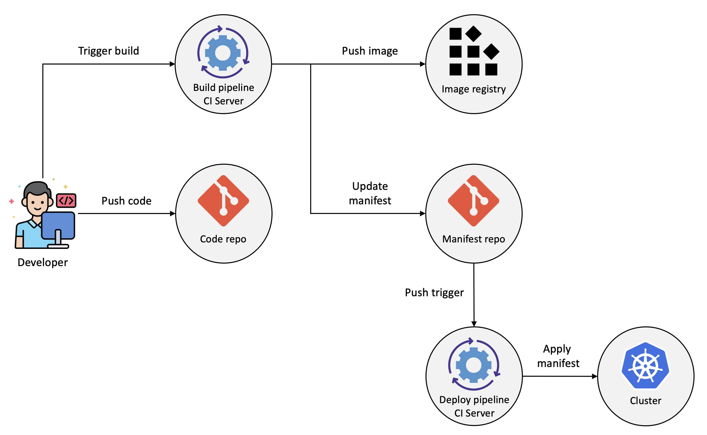
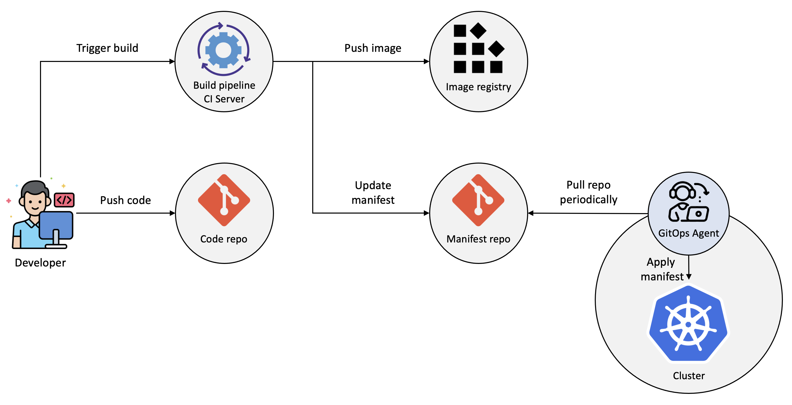

# GitOps와 ArogoCD

# 1. 개요

Gitops의 개념과 GitOps 구현체인 ArgoCD의 아키텍처를 알아본다.

# 2. GitOps

GitOps는 Git을 단일 진실의 원천(Single Source of Truth)으로 사용하여 애플리케이션 및 인프라를 선언적 방식으로 관리하는 접근 방식입이다. GitOps는 DevOps의 확장으로, Git을 통해 인프라와 애플리케이션의 상태를 관리하고 자동화된 배포 파이프라인을 구축한다.

## 1) 주요 개념

1. **선언적 구성**: 인프라와 애플리케이션의 상태를 선언적 구성 파일(YAML, JSON 등)로 정의한다.
2. **Git을 단일 진실의 원천으로 사용**: 모든 구성 파일을 Git 리포지토리에 저장하고, Git의 버전 관리 기능을 활용하여 변경 이력을 추적한다.
3. **자동화된 동기화**: Git 리포지토리의 상태와 실제 클러스터의 상태를 자동으로 동기화한다. 이를 위해 ArgoCD, Flux와 같은 도구를 사용한다.
4. **감사 및 롤백**: Git의 변경 이력을 통해 누가, 언제, 무엇을 변경했는지 추적할 수 있으며, 필요시 이전 상태로 롤백할 수 있다.

## 2) GitOps의 장점

- **버전 관리**: 모든 변경 사항이 Git에 기록되어 변경 이력을 쉽게 추적할 수 있다.
- **자동화**: 선언적 구성과 자동화된 동기화를 통해 수동 작업을 줄이고, 일관된 배포를 보장한다.
- **협업**: Git을 통해 팀 간 협업이 용이해지고, 코드 리뷰 및 승인 프로세스를 통해 품질을 보장할 수 있다.
- **안정성**: 선언적 구성과 자동화된 동기화를 통해 인프라와 애플리케이션의 상태를 일관되게 유지할 수 있다.

## 3) GitOps 워크플로우

1. **구성 파일 작성**: 애플리케이션 및 인프라의 선언적 구성 파일을 작성한다.
2. **Git 리포지토리에 커밋**: 구성 파일을 Git 리포지토리에 커밋하고 푸시한다.
3. **자동화 도구 설정**: ArgoCD, Flux와 같은 GitOps 도구를 사용하여 Git 리포지토리와 클러스터를 동기화한다.
4. **자동 동기화**: GitOps 도구가 Git 리포지토리의 변경 사항을 감지하고, 클러스터의 상태를 자동으로 업데이트한다.
5. **모니터링 및 롤백**: 변경 사항을 모니터링하고, 필요시 이전 상태로 롤백할 수 있다.

## 4) GitOps 배포전략

아래와 같이 Push/Pull Type 이렇게 두가지 방법이 있다.

### (1) Push Type

Git Repo가 변경되었을 때 파이프라인을 실행시키는 구조이다.

배포 환경의 개수에 영향을 받지 않으며 접속 정보를 추가하거나 수정하는 것만으로도 간단하게 배포 환경을 추가하거나 변경할 수 있다. 아키텍처가 쉬워 많은 곳에서 사용하고 있으나, 보안정보가 외부로 노출될 수 있다는 단점이 있다.

### (2) Pull Type 

배포하려는 클러스터에 위치한 별도의 오퍼레이터가 배포역할을 대신한다.

해당 오퍼레이터는 Git Repo의 Manifest와 배포환경을 지속적으로 비교하다가 차이가 발생할 경우, Git Repo의 Manifest를 기준으로 클러스터를 유지시켜 준다.

또한 Push Type과 달리 오퍼레이터가 App과 동일한 환경에서 동작중이므로 보안 정보가 외부에 노출되지 않고 실행할 수 있다.

## 5) GitOps 도구

- **ArgoCD**: Kubernetes 네이티브 GitOps 도구로, Git 리포지토리와 Kubernetes 클러스터를 동기화한다.
- **Flux**: Weaveworks에서 개발한 GitOps 도구로, Kubernetes 클러스터와 Git 리포지토리를 동기화한다.

## 6) 참고사이트

- [Azure Kubernetes Service용 GitOps](https://learn.microsoft.com/ko-kr/azure/architecture/example-scenario/gitops-aks/gitops-blueprint-aks)
- [What is GitOps?](https://about.gitlab.com/topics/gitops/)

# 3. ArgoCD

ArgoCD는 Kubernetes 네이티브 GitOps 도구로, Git 리포지토리를 단일 진실의 원천(Single Source of Truth)으로 사용하여 Kubernetes 클러스터의 애플리케이션을 자동으로 배포하고 관리한다. ArgoCD는 선언적 구성 파일을 사용하여 애플리케이션의 상태를 정의하고, Git 리포지토리와 Kubernetes 클러스터 간의 상태를 동기화한다.

## 1) 주요 기능

- **자동 동기화**: Git 리포지토리의 변경 사항을 감지하고, Kubernetes 클러스터의 상태를 자동으로 업데이트한다.
- **선언적 구성**: 애플리케이션의 상태를 YAML 또는 JSON 파일로 선언적으로 정의한다.
- **웹 UI 및 CLI**: 사용자 친화적인 웹 UI와 강력한 CLI를 제공하여 애플리케이션을 관리할 수 있다.
- **RBAC**: 역할 기반 접근 제어(RBAC)를 통해 사용자 권한을 관리할 수 있다.
- **헬스 체크 및 롤백**: 애플리케이션의 상태를 모니터링하고, 필요시 이전 상태로 롤백할 수 있다.
- **다중 클러스터 지원**: 여러 Kubernetes 클러스터를 관리할 수 있다.

## 2) ArgoCD 아키텍처

ArgoCD는 다음과 같은 주요 구성 요소로 이루어져 있다.

- **API 서버**: ArgoCD의 핵심 API를 제공하며, 웹 UI와 CLI를 통해 상호작용한다.
- **레포지토리 서버**: Git 리포지토리와 상호작용하여 애플리케이션의 선언적 구성을 가져온다.
- **애플리케이션 컨트롤러**: 애플리케이션의 상태를 모니터링하고, Git 리포지토리와 Kubernetes 클러스터 간의 상태를 동기화한다.
- **Dex**: SSO(Single Sign-On) 및 OAuth2 인증을 지원한다.
- **Notification 서버**: 애플리케이션 상태 변경, 동기화 상태, 헬스 체크 결과 등과 같은 이벤트에 대해 알림을 제공한다.
- **Redis**: 캐싱 및 세션 관리를 담당하여 성능을 향상시킨다.

## 3) 요약

ArgoCD는 Kubernetes 네이티브 GitOps 도구로, Git 리포지토리를 단일 진실의 원천으로 사용하여 Kubernetes 클러스터의 애플리케이션을 자동으로 배포하고 관리한다. ArgoCD는 자동 동기화, 선언적 구성, 웹 UI 및 CLI, RBAC, 헬스 체크 및 롤백, 다중 클러스터 지원 등의 기능을 제공한다. ArgoCD를 사용하면 Kubernetes 애플리케이션의 배포 및 관리를 효율적으로 수행할 수 있다.

## 4) 참고사이트

- [ArgoCD Overview](https://argo-cd.readthedocs.io/en/stable/)