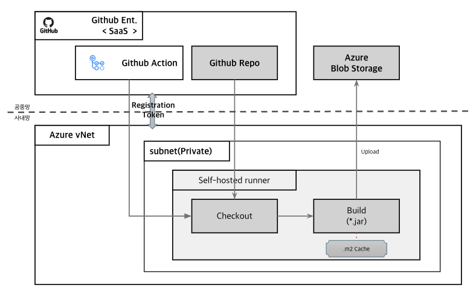
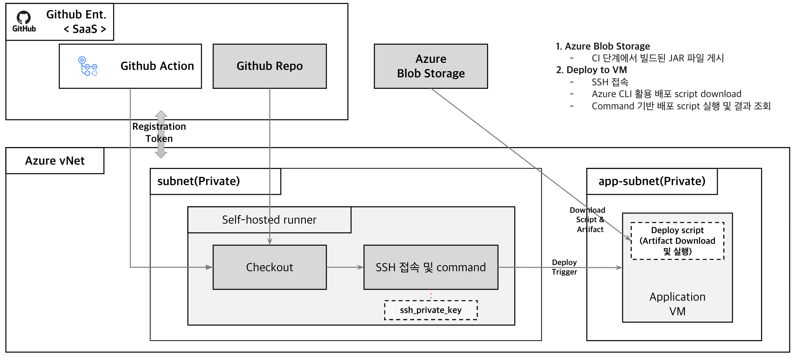

# VM Based CICD


[[_TOC_]]


# 1. 개요

Container 가 아닌 VM 에 배포되는 환경 기준으로 GitHub Actions worklow를 살펴본다.


# 2. 아키텍처

Spring Boot 애플리케이션을 SSH 기반으로 Azure VM에 배포하는 CI/CD 파이프라인의 아키텍처이다.


## 1) CI Flow



* Github Ent. <SaaS>: Github Ent. 는 공중망에 SaaS로 존재. 사내망에서 LDAP 인증으로 연결
* Checkout code: Github Repository Code Checkout
* Build with Maven: mvn clean install. Build 시간단축을 위한 Cache
* Archive JAR file: Build된 JAR 파일을 Azure Blob Storage로 Upload


## 2) CD Flow




* Github Ent. <SaaS>: CI 흐름과 동일하며 Workflow Scripte 를 보관
* Checkout: Github Repository Code Checkout
* SSH 접속 및 command : Application VM 에 SSH 방식으로 접속하여 배포작업을 수행함
* CI단계에서 Upload 한 Artifact 를 VM download 


## 3) Runner 구성

runner는 파이프라인 서두에서 지정할 수 있으며 아래와 같이 3가지를 선택할 수 있다.

- **arc-runner-axccoe**: AKS에 배포된 github runner
- **self-hosted**: Azure VM에 배포된 github runner
- **ubuntu-latest**: Github가 제공하는 github runner


# 3. Sample Workflow


### (1) workflow

```yaml
name: Deploy vm using ssh and blob 

on:
  workflow_dispatch:
    inputs:
      runner:
        required: true
        type: choice
        options:
          - arc-runner-axccoe-dev
          # - self-hosted
          - ubuntu-latest
      environment:
        description: "Deployment environment"
        required: true
        default: "dev"
        type: choice
        options:
          - dev
          - prd

jobs:
  build:
    name: (${{ inputs.environment }}) Build using maven
    runs-on: "${{ inputs.runner }}"

    steps:
    - name: Check out the repo
      uses: actions/checkout@v4.1.7
      with:
        fetch-depth: 1
        # path: ${{ github.event.repository.name }}-${{ github.ref_name }}

    - name: Configure maven settings.xml
      run: |
          cat <<EOF > ./settings.xml
          <settings>
          <servers>
              <server>
              <id>github</id>
              <username>${{ github.actor }}</username>
              <password>${{ secrets.GH_ADMIN_TOKEN }}</password>
              </server>
          </servers>
          </settings>
          EOF

    - name: Package artifact file
      run: mvn -B -DskipTests package --file ./pom.xml -s ./settings.xml

    - name: Log in to Azure CLI
      env:
        AZURE_CREDENTIALS: ${{ secrets.AZURE_CREDENTIALS_COMMON }}
      run: |
        echo "$AZURE_CREDENTIALS" > azure_credentials.json
        az login \
          --service-principal \
          --username $(jq -r .clientId azure_credentials.json) \
          -p=$(jq -r .clientSecret azure_credentials.json) \
          --tenant $(jq -r .tenantId azure_credentials.json)
        az account set --subscription $(jq -r .subscriptionId azure_credentials.json)
      shell: bash

    - name: Upload jar file to Object Storage
      run: |
        az storage blob upload \
          --account-name ${{ vars.AZURE_COMMON_STORAGE_ACCOUNT }} \
          --container-name ${{ vars.AZURE_COMMON_ARTIFACT_CONTAINER }} \
          --file ./target/*.jar \
          --name ${{ vars.APP_NAME }}.jar \
          --overwrite \
          --auth-mode login
      shell: bash

  deploy-dev:
    name: (${{ inputs.environment }}) Deploy using ssh and blob
    runs-on: "${{ inputs.runner }}"
    needs: build
    if: ${{ inputs.environment == 'dev' }}
    steps:
      - name: Deploy java app
        uses: ./.github/workflows/actions/deploy-ssh-blob-vm
        with:
          environment: "${{ inputs.environment }}"
          storage-account: "${{ vars.AZURE_COMMON_STORAGE_ACCOUNT }}"
          storage-container: "${{ vars.AZURE_COMMON_ARTIFACT_CONTAINER }}"
          storage-access-key: "${{ secrets.AZURE_COMMON_STORAGE_ACCESS_KEY }}"
          ssh-private-key: "${{ secrets.AZURE_VM_SSH_PRIVATE_KEY_DEV }}"
          vm-prefix: "${{ vars.AZURE_VM_PREFIX }}"
          vm-suffix: "vm"
          vm-ip: "${{ secrets.AZURE_VM_IP_DEV }}"
          vm-user: "${{ vars.AZURE_VM_USER }}"
          app-name: "${{ vars.APP_NAME }}"

  deploy-prd:
    name: (${{ inputs.environment }}) Deploy using ssh and blob
    runs-on: "${{ inputs.runner }}"
    needs: build
    if: ${{ inputs.environment == 'prd' }}
    strategy:
      matrix:
        vm-ips: [prd1, prd2]
    steps:
      - name: Extract VM IP
        run: echo "TARGET_VM_IP=$(echo '${{ secrets.AZURE_VM_IP_PRD }}' | jq -r .${{ matrix.vm-ips }} )" >> $GITHUB_ENV

      - name: Deploy java app
        uses: ./.github/workflows/actions/deploy-ssh-blob-vm
        env:
          TARGET_VM_IP: ${{ env.TARGET_VM_IP }}
        with:
          environment: "${{ inputs.environment }}"
          storage-account: "${{ vars.AZURE_COMMON_STORAGE_ACCOUNT }}"
          storage-container: "${{ vars.AZURE_COMMON_ARTIFACT_CONTAINER }}"
          storage-access-key: "${{ secrets.AZURE_COMMON_STORAGE_ACCESS_KEY }}"
          ssh-private-key: "${{ secrets.AZURE_VM_SSH_PRIVATE_KEY_PRD }}"
          vm-prefix: "${{ vars.AZURE_VM_PREFIX }}"
          vm-suffix: "vm"
          vm-ip: "${{ env.TARGET_VM_IP }}"
          vm-user: "${{ vars.AZURE_VM_USER }}"
          app-name: "${{ vars.APP_NAME }}"
          
```

1. workflow_dispatch
   * workflow_dispatch는 GitHub Actions에서 워크플로우를 **수동으로 트리거**할 수 있게 해주는 이벤트.
   * self-hosted runner , dev 선택
2. settings.xml
   1. CI 과정에서 settings.xml 을 생성하여 민감정보를 보호할 수 있다.

3. Maven 파일 빌드
4. blob storage에 Upload
5. Dev 환경의 VM 접속
6. Blob Storagre에서 download
7. Java Application 배포 스크립트 “deploy-jar.sh” 실행


### (2) customizing action.yml 

.github/workflows/actions/deploy-ssh-blob-vm/action.yml

```sh
name: Deploy Java App
description: Deploy Java Application to VM using ssh and blob
inputs:
  environment:
    required: true
    default: ""
  storage-account:
    required: true
    default: ""
  storage-container:
    required: true
    default: ""
  storage-access-key:
    required: true
    default: ""
  ssh-private-key:
    required: true
    default: ""
  vm-prefix:
    required: true
    default: ""
  vm-suffix:
    required: true
    default: ""
  vm-ip:
    required: true
    default: ""
  vm-user:
    required: true
    default: ""
  app-name:
    required: true
    default: ""

runs:
  using: "composite"
  steps:
    - name: Set up ssh private key
      run: |
        mkdir -p ~/.ssh/
        echo "${{ inputs.ssh-private-key }}" > ~/.ssh/${{ inputs.vm-prefix }}-${{ inputs.environment }}-${{ inputs.vm-suffix }}.pem
        chmod 600 ~/.ssh/${{ inputs.vm-prefix }}-${{ inputs.environment }}-${{ inputs.vm-suffix }}.pem
      shell: bash

    - name: Run java application
      run: |  
        ssh -i ~/.ssh/${{ inputs.vm-prefix }}-${{ inputs.environment }}-${{ inputs.vm-suffix }}.pem -o StrictHostKeyChecking=no ${{ inputs.vm-user }}@${{ inputs.vm-ip }} << 'EOF'
          set -e
          az storage blob download \
            --account-name ${{ inputs.storage-account }} \
            --container-name ${{ inputs.storage-container }} \
            --file ./deploy-jar.sh --name deploy-jar.sh --auth-mode key --account-key ${{ inputs.storage-access-key }}
          chmod 755 ./deploy-jar.sh
          ./deploy-jar.sh ${{ inputs.app-name }} ${{ inputs.vm-user }} ${{ inputs.environment }} ${{ inputs.storage-account }} ${{ inputs.storage-container }} ${{ inputs.storage-access-key }}
        EOF
      shell: bash

```


### (3) deploy-jar.sh 구성

```sh
#!/bin/bash

# Usage: ./deploy.sh <app_name> <username> <profile>
# Example: ./deploy.sh mvp-springboot-jdk17 azureadmin dev

set -e

# Parameters
APP_NAME=$1
USERNAME=$2
PROFILE=$3
STORAGE_ACCOUNT=$4
STORAGE_CONTAINER=$5
STORAGE_ACCESS_KEY=$6

# Validate parameters
if [ -z "$APP_NAME" ] || [ -z "$USERNAME" ] || [ -z "$PROFILE" ]; then
  echo "Error: Missing required parameters."
  echo "Usage: $0 <app_name> <username> <profile>"
  exit 1
fi

# Log file
LOG_FILE="/home/${USERNAME}/${APP_NAME}.log"

echo "Starting download process for application: ${APP_NAME}"
az storage blob download \
  --account-name tiurefcomsa \
  --container-name tiu-ref-com-arti-con \
  --file ./${APP_NAME}.jar --name ${APP_NAME}.jar \
  --auth-mode key --account-key ${STORAGE_ACCESS_KEY}
echo "Download completed. Artifact filename is ${APP_NAME}.jar..."

echo "Starting deployment process for application: ${APP_NAME}"
echo "Using user: ${USERNAME}"
echo "Spring profile: ${PROFILE}"

# Kill any existing process running with the JAR name
echo "Attempting to stop any running instances of ${APP_NAME}.jar..."
sudo pkill -f "${APP_NAME}.jar" || true
echo "Process termination completed."

# Start the new process
echo "Starting the new instance of ${APP_NAME}.jar with profile ${PROFILE}..."
nohup java -jar /home/${USERNAME}/${APP_NAME}.jar \
    --spring.profiles.active=${PROFILE} >> ${LOG_FILE} 2>&1 &
echo "New process started. Logs are being written to ${LOG_FILE}."

echo "Deployment completed successfully."

```

